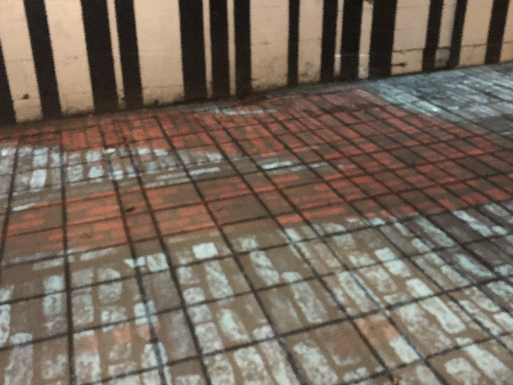
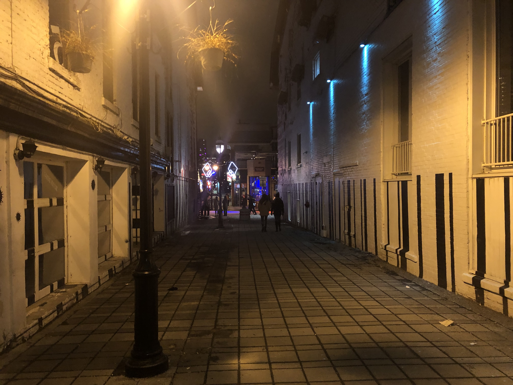
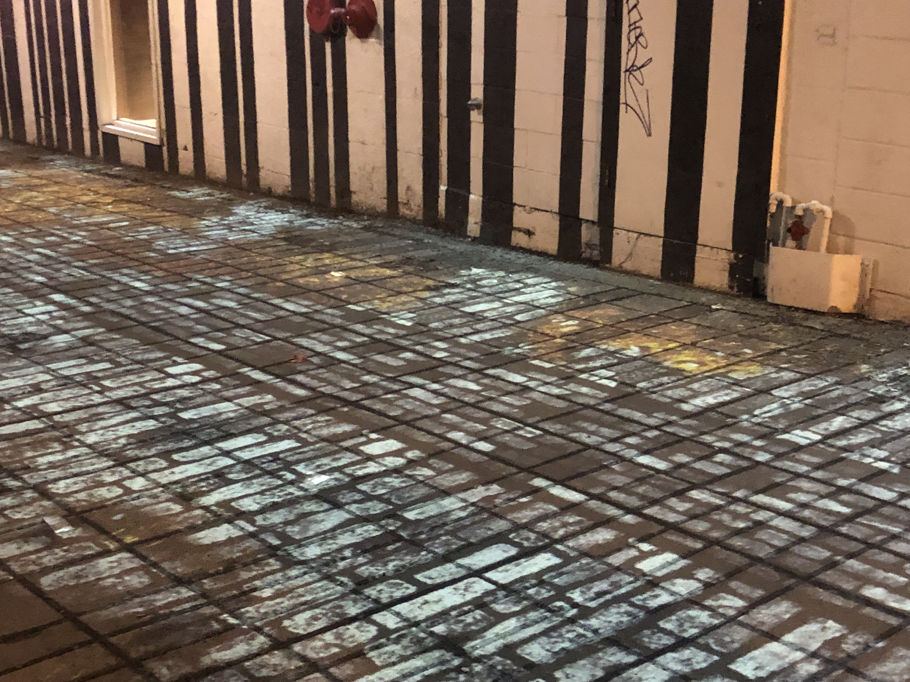
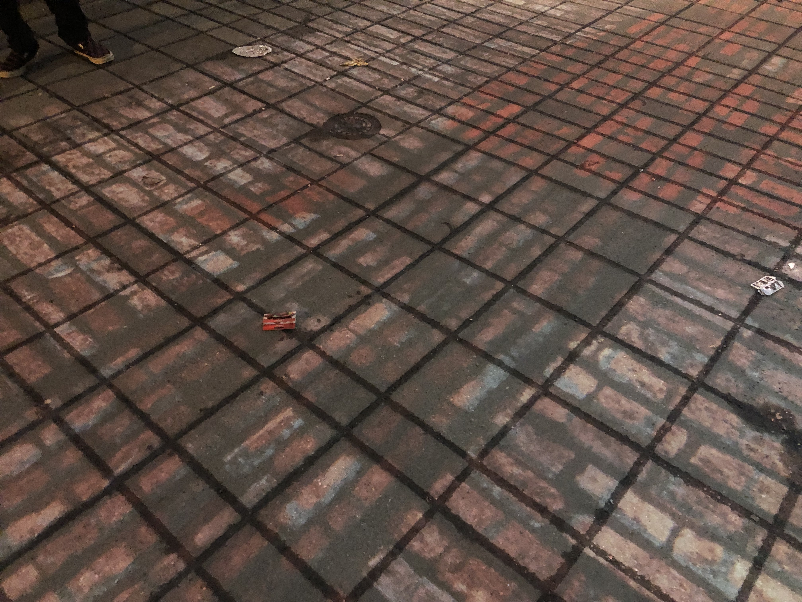
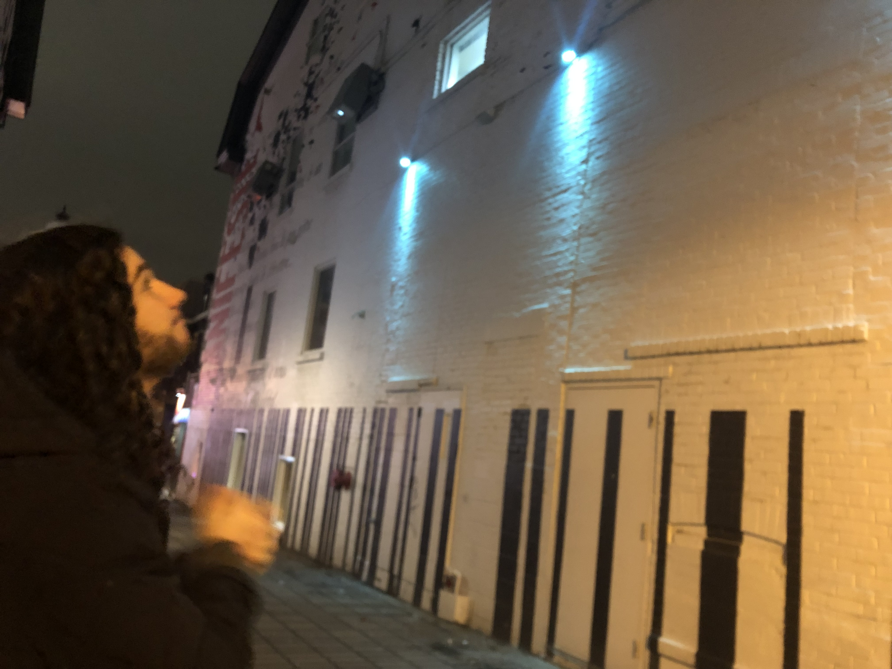
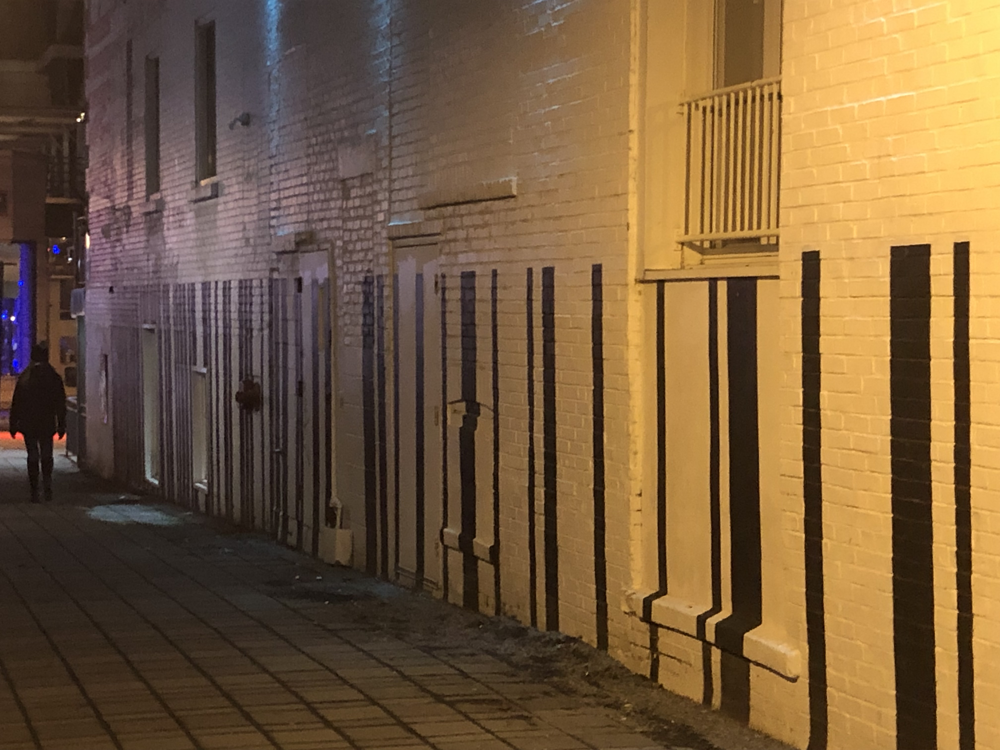
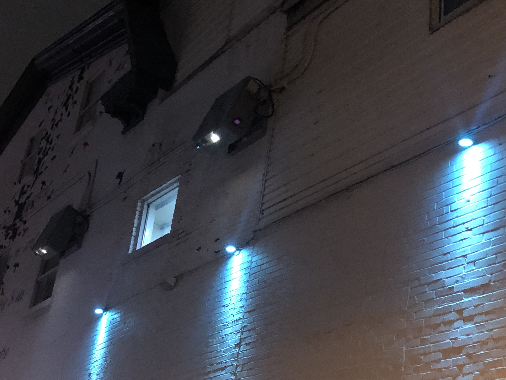
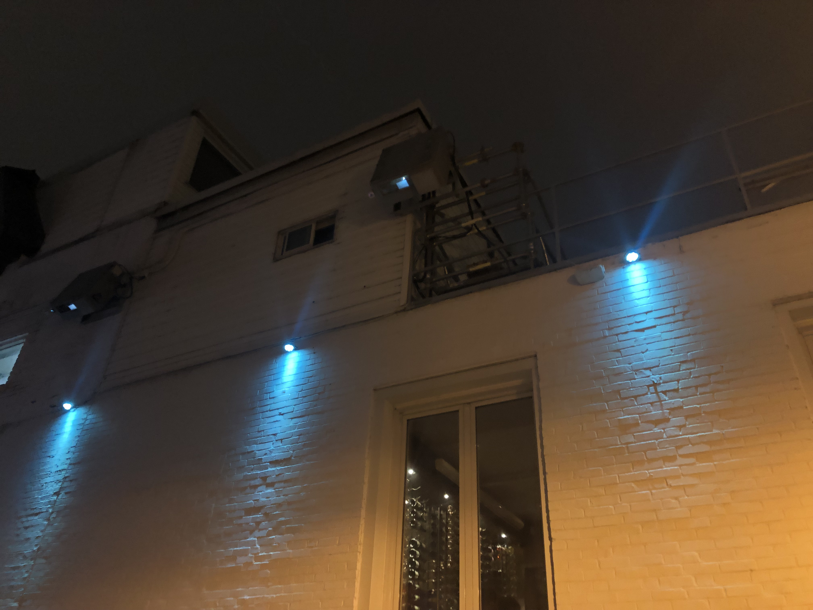
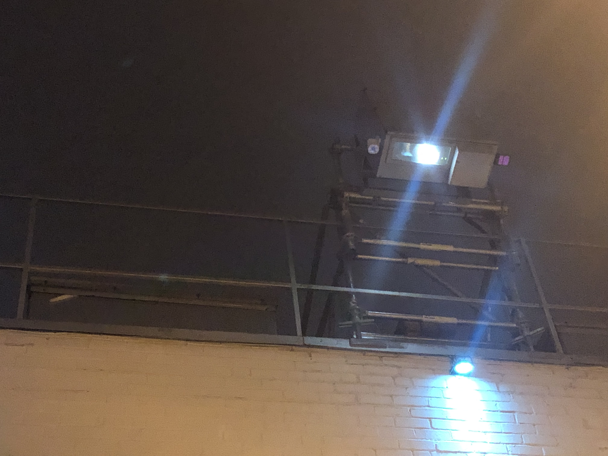

# Exposition : Cité Mémoire - Naissance du monde

## Informations

### Nom de l'exposition ou de l'événement
- Cité Mémoire

Vue de l'oeuvre. ‎ ‎ ‎ ‎ ‎ ‎ ‎ ‎ ‎ ‎ ‎ ‎ ‎ ‎ ‎ ‎‎ ‎ ‎ ‎ ‎ ‎ ‎ ‎ ‎ ‎ ‎‎ ‎ ‎ ‎‎ ‎ ‎ ‎‎ ‎‎ ‎ ‎‎ ‎ ‎ ‎ ‎‎ ‎ ‎ ‎ ‎ ‎ ‎ ‎ ‎ ‎ ‎ ‎ ‎ ‎ ‎‎ ‎‎ ‎ ‎ ‎Photo de l'oeuvre en grand plan.

### Lieu de mise en exposition
- Place Paul-Émile Borduas dans le Quartier des spectacles

Vue de la ruelle. ‎ ‎ ‎ ‎ ‎ ‎ ‎ ‎ ‎ ‎‎ ‎ ‎ ‎ ‎ ‎ ‎ ‎ ‎ ‎ ‎ ‎ ‎ ‎ ‎ ‎‎ ‎ ‎ ‎ ‎ ‎ ‎ ‎ ‎ ‎‎ ‎ ‎ ‎ ‎ ‎ ‎ ‎ ‎ ‎‎ ‎ ‎ ‎ ‎ ‎ ‎ ‎ ‎ ‎Vue de l'autre côté.

### Type d'exposition
- Temporaire

### Date de votre visite
- 23 Février 2024

### Titre de l'œuvre
- Naissance du monde

Vue de l'oeuvre. ‎ ‎ ‎ ‎ ‎ ‎ ‎ ‎ ‎ ‎ ‎ ‎ ‎ ‎ ‎ ‎‎ ‎ ‎ ‎ ‎ ‎ ‎ ‎ ‎ ‎ ‎‎ ‎ ‎ ‎‎ ‎ ‎ ‎‎ ‎‎ ‎ ‎‎ ‎ ‎ ‎ ‎‎ ‎ ‎ ‎ ‎ ‎ ‎ ‎ ‎ ‎ ‎ ‎ ‎ ‎ ‎‎ ‎‎ ‎ ‎ ‎Photo de l'oeuvre.

### Nom de l'artiste
- Michel Lemieux

### Année de réalisation
- 2021

### Description de l'œuvre
- "Naissance du Monde" est l'une des nombreuses oeuvres faisant partie de l'exposition Cité Mémoire. Cette oeuvre se déroule dans une ruelle du quartier des arts à Montréal, où l'on observe des fonds abstraits en mouvement projetés sur le sol. 

Photo d'une goutelette de lumière

### Type d'installation
- Contemplative

Photo d'une personne contemplant l'oeuvre.

https://github.com/ryandufault/H24_V11_inspirations_DUFAULT/assets/142917876/cc7eb1ee-3efa-4d4a-93f3-771617a9cef5

Vidéo de moi qui contemple l'oeuvre.

### Mise en espace
- L'ensemble de l'oeuvre est présente dans une ruelle. Multiples projecteurs affichent l'oeuvre et éclairent le sol

Photo d'ensemble de l'oeuvre et de son entourage.

### Composantes et techniques
- L'oeuvre se compose uniquement de projecteurs.

Photo de projecteurs. ‎ ‎ ‎ ‎ ‎ ‎ ‎ ‎ ‎ ‎ ‎ ‎ ‎ ‎ ‎ ‎‎ ‎ ‎ ‎ ‎ ‎ ‎ ‎ ‎ ‎ ‎‎ ‎ ‎ ‎‎ ‎ ‎ ‎‎ ‎‎ ‎ ‎‎ ‎ ‎  ‎ ‎ ‎ ‎‎ ‎‎ ‎ ‎ ‎Photo de lumières.

### Éléments nécessaires à la mise en exposition
-Comme précisé, des projecteurs diffusent l'oeuvre. Je suppose également qu'il y a plusieurs câbles pour relier l'ensemble.

Photo d'un projecteur. ‎ ‎ 

### Expérience vécue
- Je pense qu'on attend de nous de simplement regarder et contempler. Il y a une immersion très intense simplement en observant l'œuvre, les jeux de lumières nous immersent, même si au fond nous sommes simplement assis à regarder des écrans.

https://github.com/ryandufault/H24_V11_inspirations_DUFAULT/assets/142917876/824b774e-bdd4-4087-a921-795fb269f34a

Vidéo de mon expérience vécue montrant des vagues de lumières.

### Ce qui vous a plu, vous a donné des idées
- J'ai particulièrement apprécié l'abstraction des formes et des couleurs qui se mélangeaient. Cela créait une expérience immersive captivante. De plus, l'oeuvre était divisée par fréquence, dans le sens où à certains moments, les formes et les fonds bougeaient plus vite et se déformaient plus rapidement.

Photos démontrant différentes fréquences.

### Aspect que vous ne souhaiteriez pas retenir pour vos propres créations ou que vous feriez autrement
- Le principal problème de l'exposition était sa lenteur et sa visibilité très réduite à certains moments. Au début, lorsque je suis arrivé sur les lieux, je me suis demandé si je m'étais perdu car je ne percevais rien mis à part une faible lueur projetée au sol. Après avoir attendu un certain temps, des formes et des lueurs ont commencé à apparaître. Parfois, je me demandais si l'exposition était terminée, car il ne se passait plus rien pendant de longues minutes, puis de nouvelles formes et lueurs apparaissaient, et ainsi le cycle se répétait. Il y a aussi le fait que l'oeuvre n'est vraiment pas grande, celle-ci prend vraiment un très petit pourcentage de la ruelle. 

Photo illustrant une faible fréquence où peu d'événements se produisent.

### Références
- [Quartier des spectacles - La naissance du monde | Cité Mémoire](https://www.quartierdesspectacles.com/fr/activite/30502/la-naissance-du-monde-tableau-cite-memoire)
