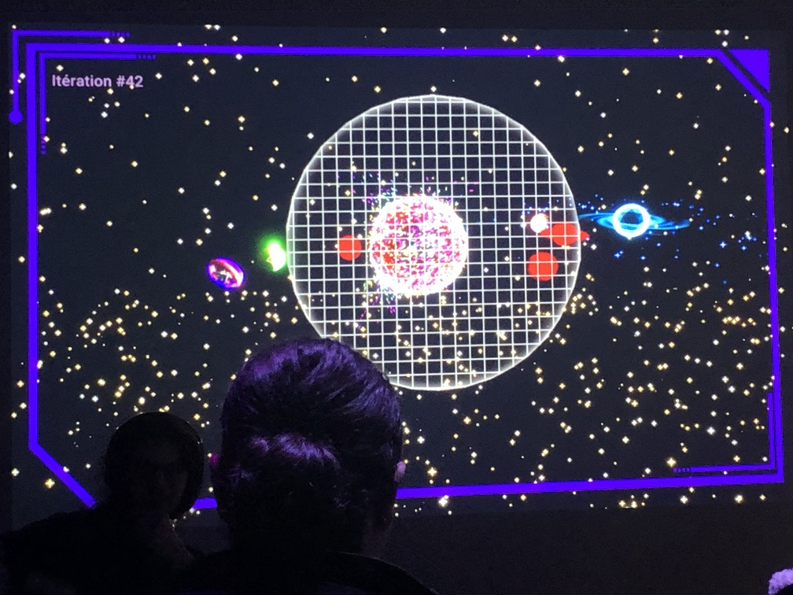
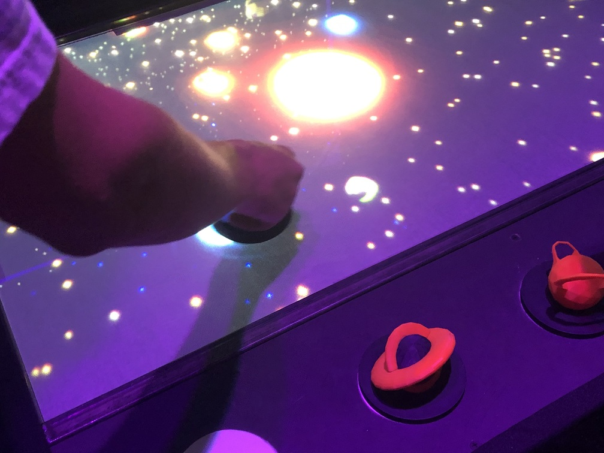
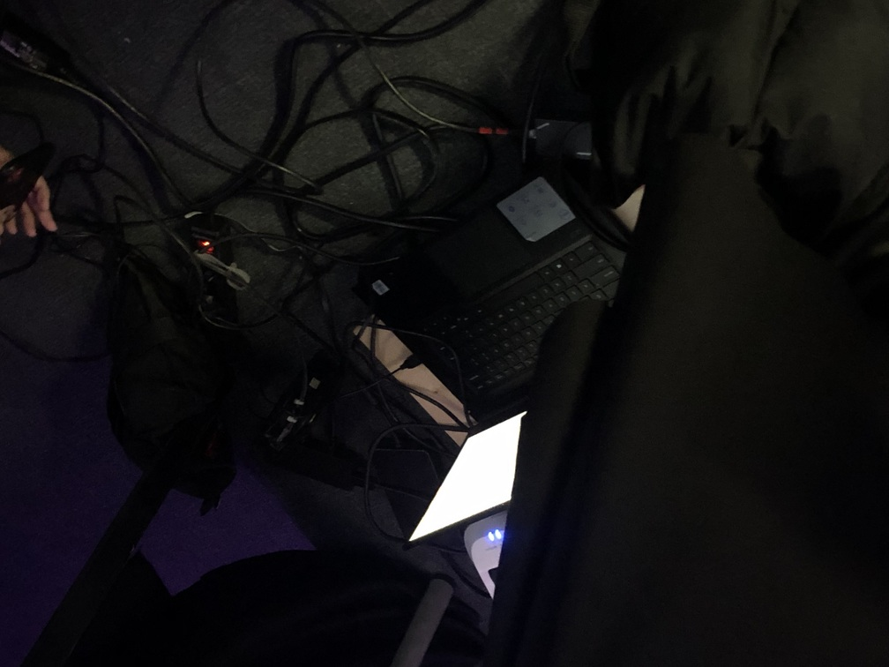
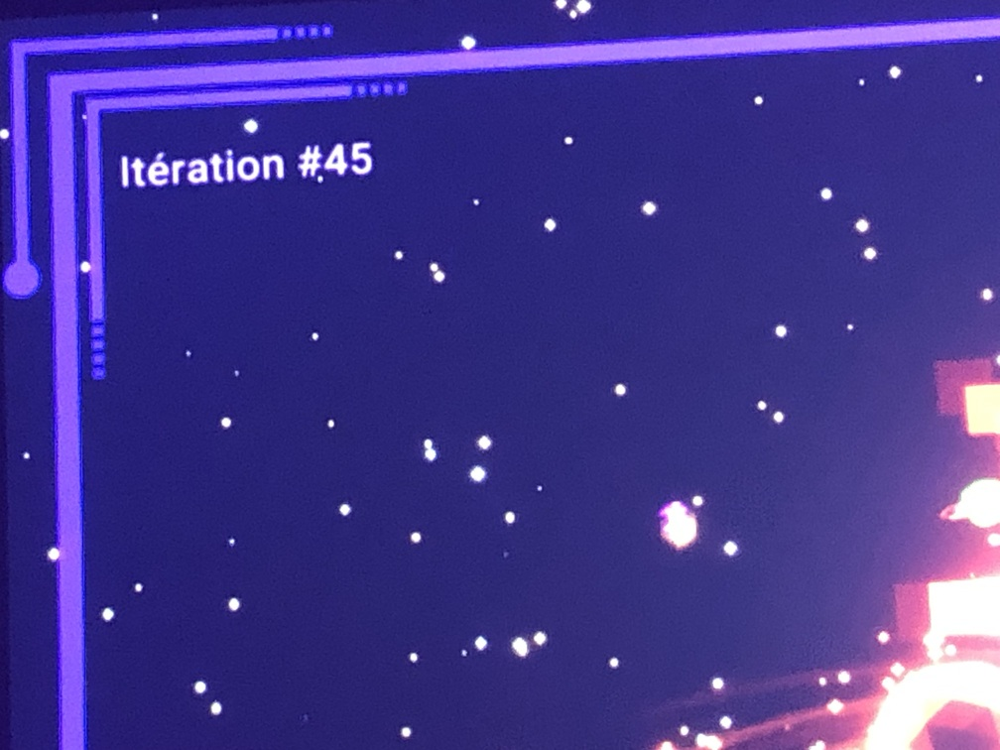
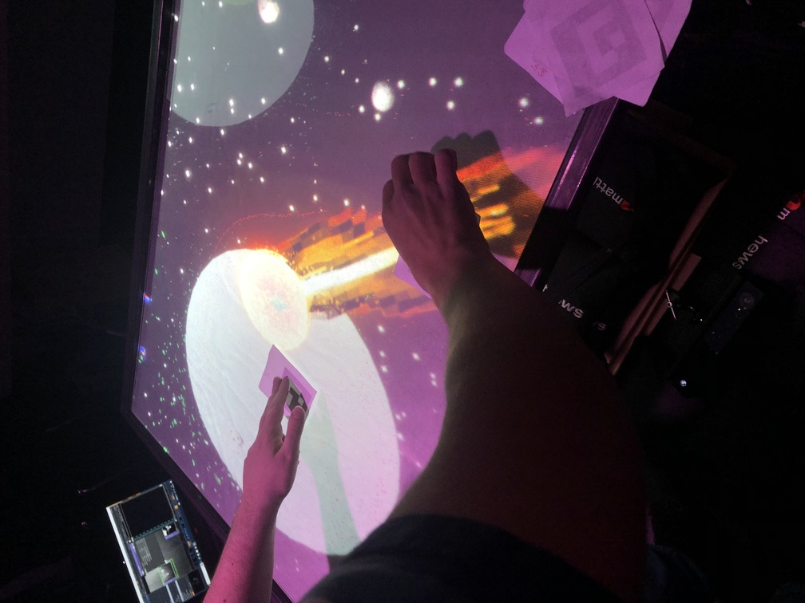
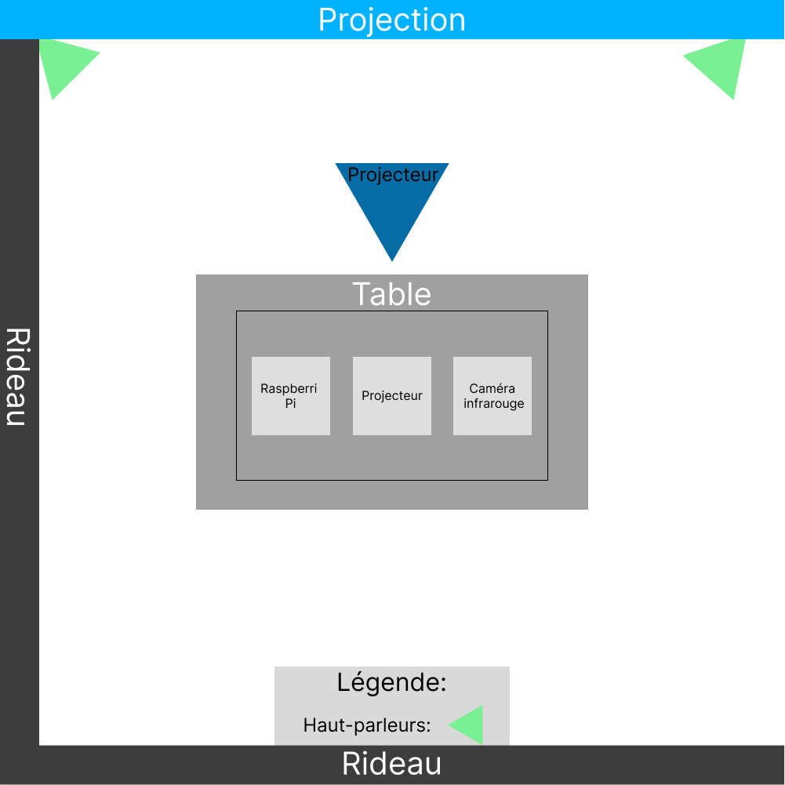

# Exposition : Canevas Cosmique
### Créateurs et créatrices
- Jacob Alarie-Brousseau
- Étienne Charron
- Jérémy Cholette
- Quoc Huy Do
- Mikaël Tourangeau

## Lien avec Crescentia
Canevas Cosmique est une expérience immersive où les visiteurs peuvent interagir avec une simulation de système solaire. À travers cette expérience, on explore la notion de création et de manipulation d'un univers cosmique. Le lien est que la créativité est présente lorsque l'on crée.

## Installation

https://github.com/ryandufault/H24_V11_inspirations_DUFAULT/assets/142917876/72180687-a223-42fb-bc35-09e05aec7242

## Schéma prévu pour l'installation

(source: [Canevas-Cosmique](https://tim-montmorency.com/2024/projets/Canevas-Cosmique/docs/web/preproduction.html))

## Lien 
[Canevas-Cosmique](https://tim-montmorency.com/2024/projets/Canevas-Cosmique/docs/web/index.html)

