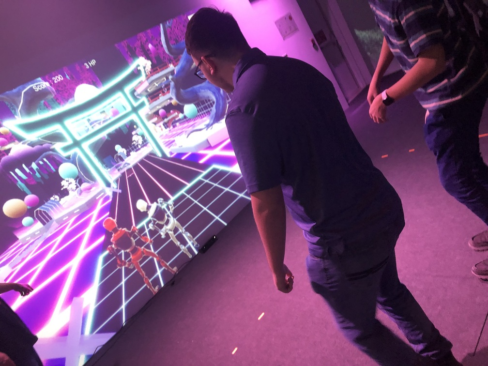
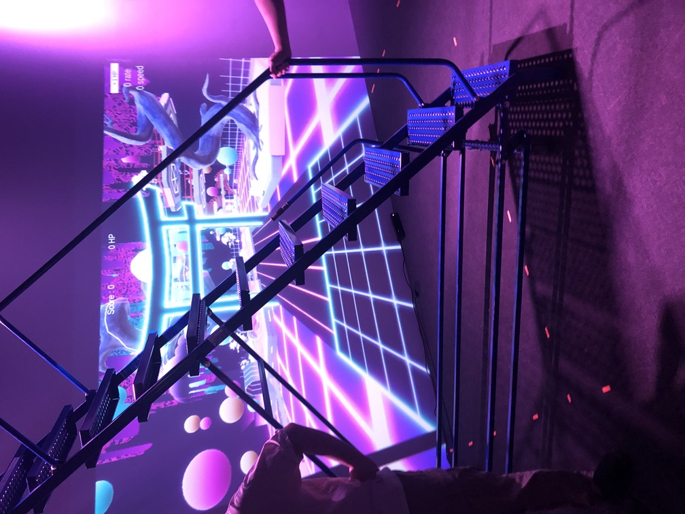
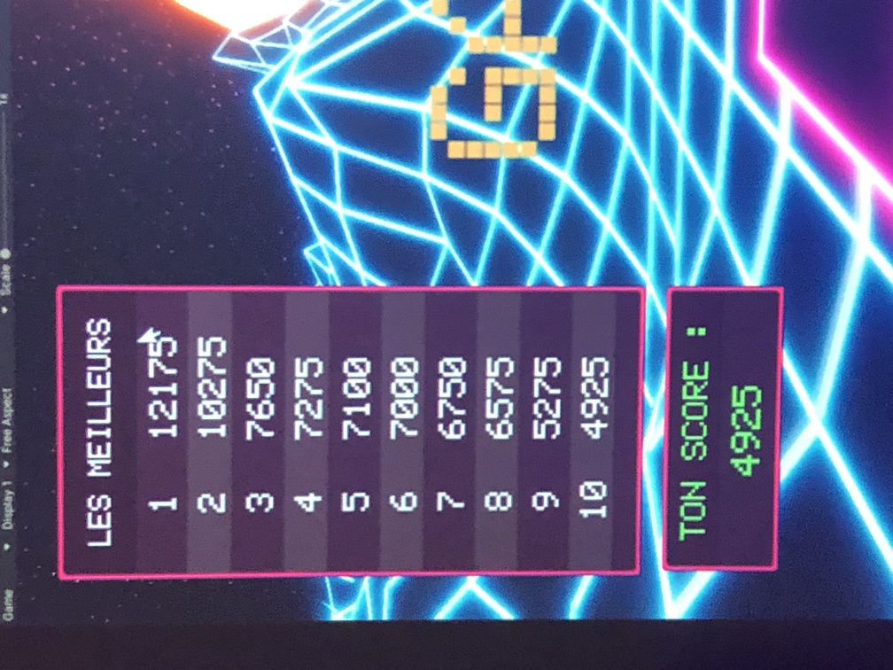

# Exposition : Kigo
### Créateurs et créatrices
- Érick Ouellette
- William Rathier Mailly
- Gabriel Clerval
- Nicolas St-Martin
- Antoine Dion

## Lien avec Crescentia
Kigo est un jeu interactif avec des visuels néon rétro changeants pour représenter les quatre saisons. Cette expérience engageante invite les participants à découvrir et à interagir avec un univers visuel dynamique. Crescentia pourrait être interprété comme une référence à la variété et au changement, ce qui explique le lien avec Kigo.

## Installation

<iframe width="350" height="215" src="https://www.youtube.com/embed/apgK9zt7uBw?si=i7BpAxmCVy_PP-uI&amp;controls=0" title="YouTube video player" frameborder="0" allow="accelerometer; autoplay; clipboard-write; encrypted-media; gyroscope; picture-in-picture; web-share" allowfullscreen></iframe>

## Schéma prévu pour l'installation

(source: [Kigo](https://tim-montmorency.com/2024/projets/Kigo/docs/web/preproduction.html))

## Lien 
[Kigo](https://tim-montmorency.com/2024/projets/Kigo/docs/web)

