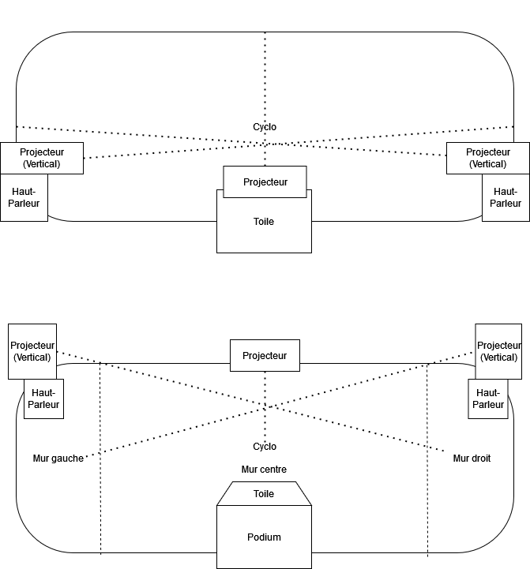

# Exposition : Rhizomatique
### Créateurs et créatrices
- Jolyanne Desjardins
- MaÏka Désy
- Laurie Houde
- Felix Testa Radovanovic

## Lien avec Crescentia
Rhizomatique explore la façon dont nous nous souvenons et interagissons avec le passé. En permettant aux visiteurs de naviguer à travers les souvenirs d'une personne inconnue, Rhizomatique correspond à l'objectif de Crescentia d'engager les gens dans une réflexion sur ce qui nous rend humains. La représentation du cerveau dans Rhizomatique reflète des souvenirs, établissant un lien avec la vision artistique globale de Crescentia.

## Installation

## Schéma prévu pour l'installation

## Lien 
[Rhizomatique](https://tim-montmorency.com/2024/projets/Rhizomatique/docs/web/index.html)
