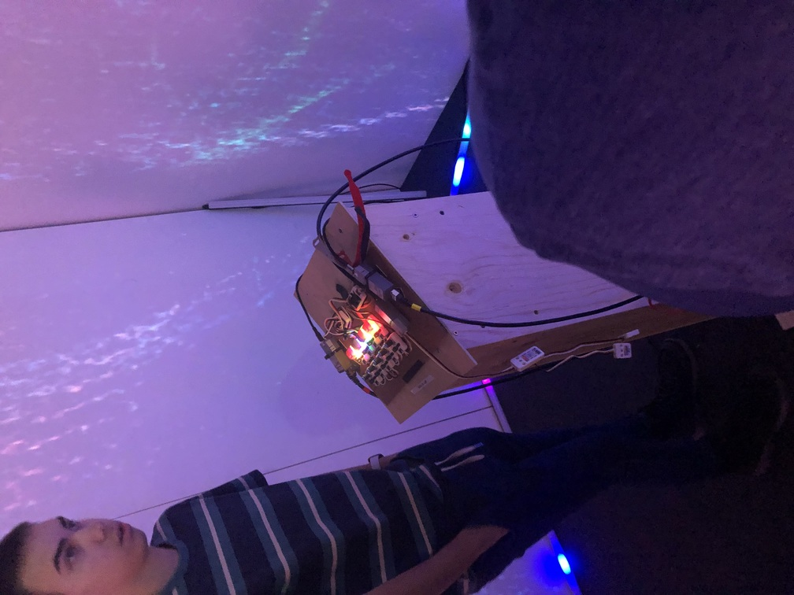

# Oeuvre : Sonalux
### Créateurs et créatrices
- Antoine Haddad
- Camélie Laprise
- Ghita Alaoui
- Vincent Desjardins

## Lien avec Crescentia
L'exposition Sonalux offre une expérience multimédia immersive où les participants sont transportés dans un monde de voyage astral. À travers cette installation, Sonalux explore la notion de transcendance du temps et de l'espace, invitant les participants à devenir les maîtres de leur propre expérience grâce à l'interaction avec les instruments présentés sur le podium. Sonalux incarne la vision créative et immersive de Crescentia.

## Installation

Photo des boutons. ‎ ‎ ‎ ‎ ‎ ‎ ‎ ‎ ‎ ‎  ‎‎ ‎ ‎ ‎ ‎ ‎ ‎ ‎ ‎ ‎ ‎‎ ‎ ‎ ‎ ‎‎ ‎‎ ‎ ‎ ‎ ‎ ‎ ‎ ‎‎ ‎ ‎ ‎ ‎ ‎ ‎ ‎‎ ‎ ‎ ‎ ‎ ‎ ‎ ‎ ‎ ‎ ‎‎ ‎ ‎ ‎ ‎‎ ‎‎ ‎  ‎ ‎‎ ‎ ‎ ‎ ‎ ‎ ‎ ‎ ‎‎ ‎ ‎ ‎ ‎ ‎ ‎ ‎ ‎ ‎ ‎ ‎ ‎‎ ‎ ‎ ‎ ‎‎ ‎‎ ‎ ‎  ‎ ‎ ‎ ‎ ‎ ‎ ‎ ‎‎ ‎ ‎ ‎ ‎ ‎ ‎ ‎ ‎ ‎ ‎‎ ‎ ‎ ‎ ‎‎ ‎‎ ‎ ‎ ‎Photo de l'eclairage.

Photo de l'oeuvre en ensemble. ‎ ‎ ‎ ‎ ‎ ‎  ‎ ‎  ‎ ‎ ‎ ‎ ‎ ‎ ‎ ‎ ‎ ‎ ‎ ‎‎ ‎ ‎ ‎ ‎ ‎  ‎ ‎ ‎ ‎Photo de l'installation et des branchements.

Photo de l'oeuvre. ‎ ‎ ‎ ‎ ‎ ‎ ‎ ‎ ‎ ‎ ‎ ‎ ‎ ‎ ‎ ‎‎ ‎ ‎ ‎ ‎ ‎ ‎ ‎ ‎ ‎ ‎‎ ‎ ‎  ‎ ‎ ‎ ‎‎ ‎‎ ‎ ‎ ‎ ‎ ‎‎ ‎ ‎ ‎ ‎ ‎ ‎ ‎‎ ‎ ‎ ‎ ‎ ‎ ‎ ‎ ‎ ‎ ‎‎ ‎ ‎ ‎ ‎‎ ‎‎ ‎ ‎ ‎ ‎ ‎ ‎ ‎ ‎ ‎ ‎‎ ‎ ‎ ‎ ‎ ‎ ‎ ‎ ‎ ‎ ‎‎ ‎ ‎ ‎ ‎‎ ‎‎ ‎ ‎  ‎ ‎ ‎ ‎ ‎ ‎ ‎ ‎‎ ‎ ‎ ‎ ‎ ‎ ‎ ‎ ‎ ‎ ‎‎ ‎ ‎ ‎ ‎‎ ‎‎ ‎ ‎ ‎‎Photo de l'oeuvre en action.

## Schéma prévu pour l'installation

(source: [Sonalux](https://tim-montmorency.com/2024/projets/Sonalux/docs/web/preproduction.html))

## Lien de l'oeuvre
[Sonalux](https://tim-montmorency.com/2024/projets/Sonalux/docs/web/index.html)

