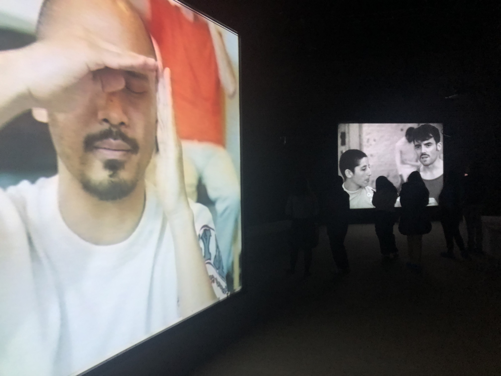

# Exposition : Jeremy Shaw - Phase Shifting Index

## Information recherchée

| :pencil2: Information recherchée           | :camera: Appui visuel à intégrer        | Détails supplémentaires                |
|---------------------------------------------|-----------------------------------------|----------------------------------------|
| Nom de l'exposition ou de l'événement       |       | Jeremy Shaw - phase shifting index    |
| Lieu de mise en exposition                 |       | Fonderie Darling (Montréal)           |
| Type d'exposition (temporaire, permanente, itinérante, intérieure, extérieure) |                                          |                                        |
| Date de votre visite                       |                                          | 31 Janvier 2024                        |
| Titre de l'œuvre                           |          | Phase Shifting Index                   |
| Nom de l'artiste                           |                                          | Jeremy Shaw                            |
| Année de réalisation                       |                                          | 2020                                   |
| Description de l'œuvre                     |   | Phase Shifting Index [Index d’états de transition] est une rêverie parascientifique exaltante d’une grande ambition intellectuelle et artistique, et le point culminant des travaux récents de Shaw. Dans ce qui semble être une étude anthropologique d’un futur lointain, une narration commente de manière rétrospective l’émergence de nouvelles réalités déconcertantes sur sept écrans affichant ce qui s’avère être des images d’archives de divers groupes de thérapie par le mouvement des années 60 aux années 90. Ces images sont captées dans les formats de l’époque – allant du film 16 mm au VHS en passant par le Hi-8. (source: Mac, [Lien vers la source](https://macm.org/expositions/jeremy-shaw/)) |
| Type d'installation (contemplative, immersive, interactive) |   |                                        |
| Mise en espace                             |   | L'ensemble de l'œuvre est présente dans une pièce remplie de tapis, avec 7 écrans disposés de manière spécifique diffusant simultanément l'œuvre. Quelques bancs sont disposés dans la salle. |
| Composantes et techniques                  |    | L'œuvre se compose en partie de projecteurs, ainsi que de 7 écrans qui constituent l'élément principal de ce qui est visible. De plus, des faisceaux de lumière ajoutent à l'ambiance, et des haut-parleurs diffusent la bande sonore du projet. |
| Éléments nécessaires à la mise en exposition|    | Quelques bancs sont disposés pour renforcer l'immersion. Comme précisé, des projecteurs diffusent les vidéos. Je suppose également qu'il y a plusieurs câbles pour relier l'ensemble. |
| Expérience vécue                          |    | Je pense qu'on attend de nous de simplement regarder et contempler. Il y a une immersion très intense simplement en observant l'œuvre, et les jeux de lumières et de son nous immersent véritablement, même si au fond nous sommes simplement assis à regarder des écrans. |
| :heart: Ce qui vous a plu, vous a donné des idées |   | J'ai particulièrement apprécié la synchronisation des plans sur les sept écrans lors de l'exposition. Cela créait une expérience immersive captivante. De plus, la bande sonore était remarquable dans sa capacité à susciter et à amplifier les émotions. |
| :thinking: Aspect que vous ne souhaiteriez pas retenir pour vos propres créations ou que vous feriez autrement |   | Dans la quatrième phase de l'exposition, j'ai trouvé que les couleurs choisies pour les particules et l'éclairage n'étaient pas tout à fait adaptées à l'ambiance générale. Elles manquaient d'abstraction et ne semblaient pas totalement en harmonie avec le thème de l'exposition. |
| Références                                 |                                          | [Lien vers la source](https://macm.org/expositions/jeremy-shaw/) |

